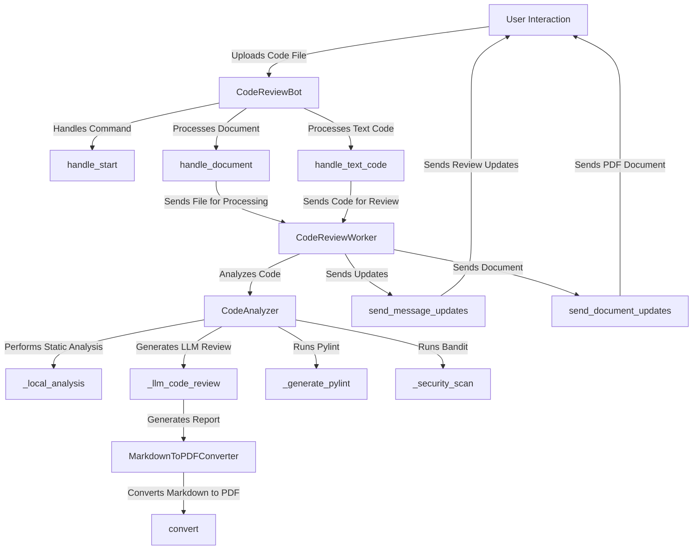

# Evraz Code Review Bot

## Обзор

**Evraz Code Review Bot** — это интеллектуальный бот, разработанный для автоматизированной проверки кода. Он использует передовые языковые модели и инструменты статического анализа для предоставления комплексной обратной связи по качеству кода, уязвимостям безопасности и соблюдению передовых практик. Бот создан с использованием Python и интегрируется с Telegram для упрощения взаимодействия с пользователем.

## Функции

- Анализ различных языков программирования, включая Python, JavaScript и C++.
- Поддержка загрузки файлов `.zip`, содержащих несколько файлов или папок, для пакетного анализа.
- Создание подробных отчетов по проверке кода в формате Markdown.
- Конвертация отчетов Markdown в PDF для простого обмена и документирования.
- Использование современных языковых моделей для интеллектуального анализа кода.

## Содержание

- [Установка](#установка)
- [Использование](#использование)
- [Как это работает](#как-это-работает)
- [Описания классов](#описания-классов)
- [Поток выполнения](#поток-выполнения)
- [Демонстрационное видео](#демонстрационное-видео) 

## Диаграмма рабочего процесса



## Установка

1. **Клонируйте репозиторий:**
```bash
git clone https://github.com/yourusername/evraz-code-review-bot.git
cd evraz-code-review-bot
```

2. **Запустите скрипт установки:**
```bash
bash start.sh
```

Этот скрипт установит все необходимые предварительные требования, включая Python и требуемые библиотеки Python.

3. **Настройте переменные среды:**
Создайте файл `.env` в корневом каталоге и добавьте следующие переменные:
```bash
REDIS_URL=your_redis_url
TELEGRAM_BOT_TOKEN=your_telegram_bot_token
LLM_API_KEY=your_llm_api_key
LLM_END_POINT=your_llm_endpoint_url
```

## Использование

1. **Запустите бота:**

Запустите бота с помощью команды:
```bash
python3 bot.py
```

2. **Взаимодействуйте с ботом:**
- Отправьте команду `/start`, чтобы начать разговор.
- Загрузите файл кода или архив `.zip`, содержащий несколько файлов кода.
- Бот проанализирует код и предоставит обратную связь.

## Как это работает

Бот Evraz Code Review использует следующие компоненты:

- **API Telegram Bot:** для взаимодействия с пользователем и обработки сообщений.
- **Celery:** для асинхронной обработки задач, что позволяет боту обрабатывать несколько запросов одновременно.
- **Инструменты статического анализа:** такие как Pylint и Bandit для проверки качества и безопасности кода.
- **LLM (языковая модель):** для создания интеллектуальной обратной связи на основе пользовательских рекомендаций и передового опыта.

## Описания классов

### 1. `CodeReviewBot`
Основной класс, который обрабатывает взаимодействие с API Telegram. Он управляет пользовательскими командами и загрузкой файлов.

**Ключевые методы:**
- `handle_start`: отвечает на команду `/start`.
- `handle_document`: обрабатывает загруженные файлы кода.
- `handle_text_code`: обрабатывает прямые текстовые сообщения кода.

### 2. `CodeReviewWorker`
Обрабатывает процесс анализа кода, используя класс `CodeAnalyzer`. Он управляет созданием отчетов по проверке кода и отправкой обновлений пользователям.

**Ключевые методы:**
- `process_code_review`: Анализирует предоставленный код и создает отчет.
- `_load_guidelines`: Загружает пользовательские рекомендации по качеству кода.

### 3. `CodeAnalyzer`
Выполняет статический анализ и интегрируется с LLM для создания обзоров кода. Он использует различные инструменты, такие как Pylint и Bandit для анализа.

**Ключевые методы:**
- `analyze`: Проводит комплексный анализ содержимого кода.
- `_local_analysis`: Выполняет локальный статический анализ кода.
- `_llm_code_review`: Использует LLM для создания отчета по проверке.

### 4. `MarkdownToPDFConverter`
Преобразует созданные отчеты Markdown в формат PDF для удобства обмена.

**Ключевые методы:**
- `convert`: преобразует текст Markdown в формат PDF.

## Поток выполнения

1. **Взаимодействие с пользователем:**
- Пользователь запускает бота и загружает файл кода или архив `.zip`.

2. **Обработка файла:**
- Бот получает файл и делегирует обработку `CodeReviewWorker`.

3. **Анализ кода:**
- `CodeAnalyzer` выполняет статический анализ с использованием таких инструментов, как Pylint и Bandit.
- Он создает отчет на основе анализа и отправляет его LLM для дальнейшего анализа.

4. **Создание отчета:**
- Бот преобразует созданный отчет в формат Markdown.

- Затем он преобразует отчет Markdown в формат PDF для загрузки пользователем.

5. **Обратная связь:**
- Бот отправляет сгенерированный отчет PDF обратно пользователю через Telegram.

## Демонстрационное видео
Работает как с `.zip`, так и с отдельными файлами: [Смотреть видео](./demo/video.mp4)